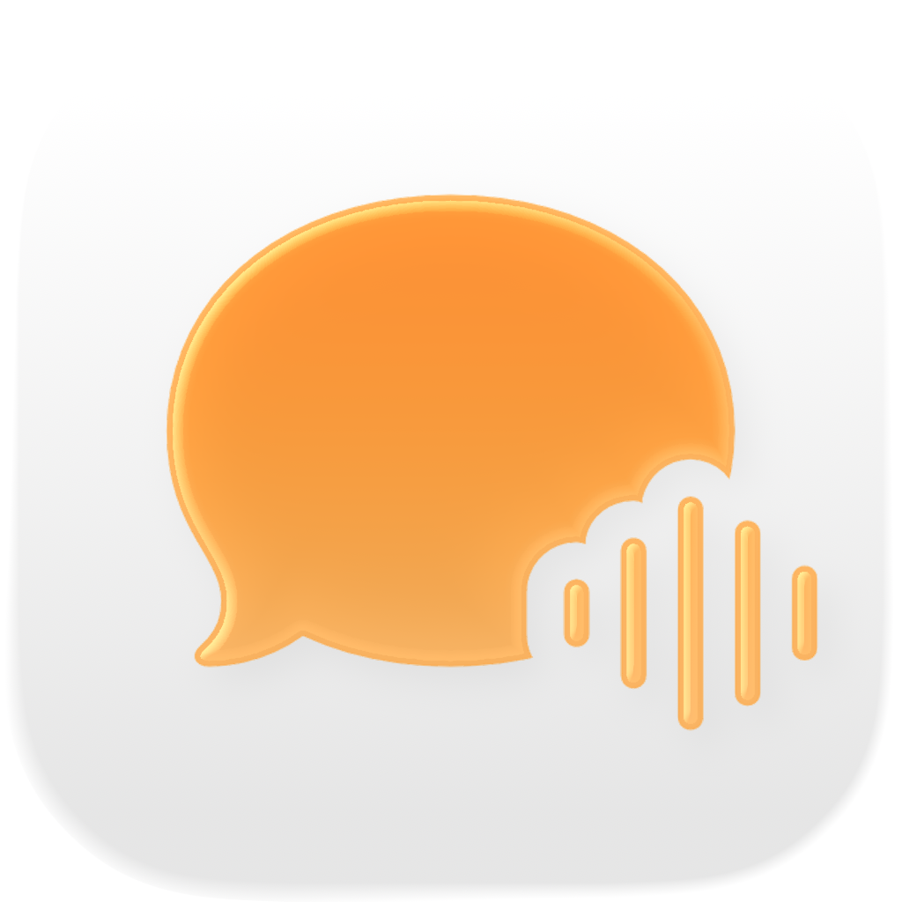
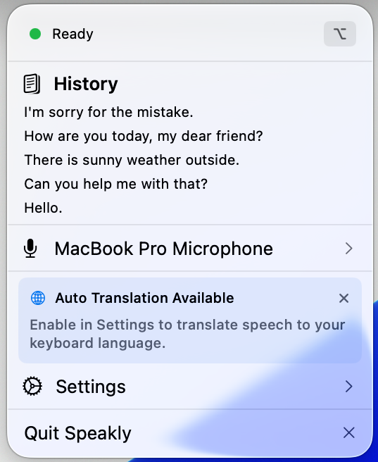
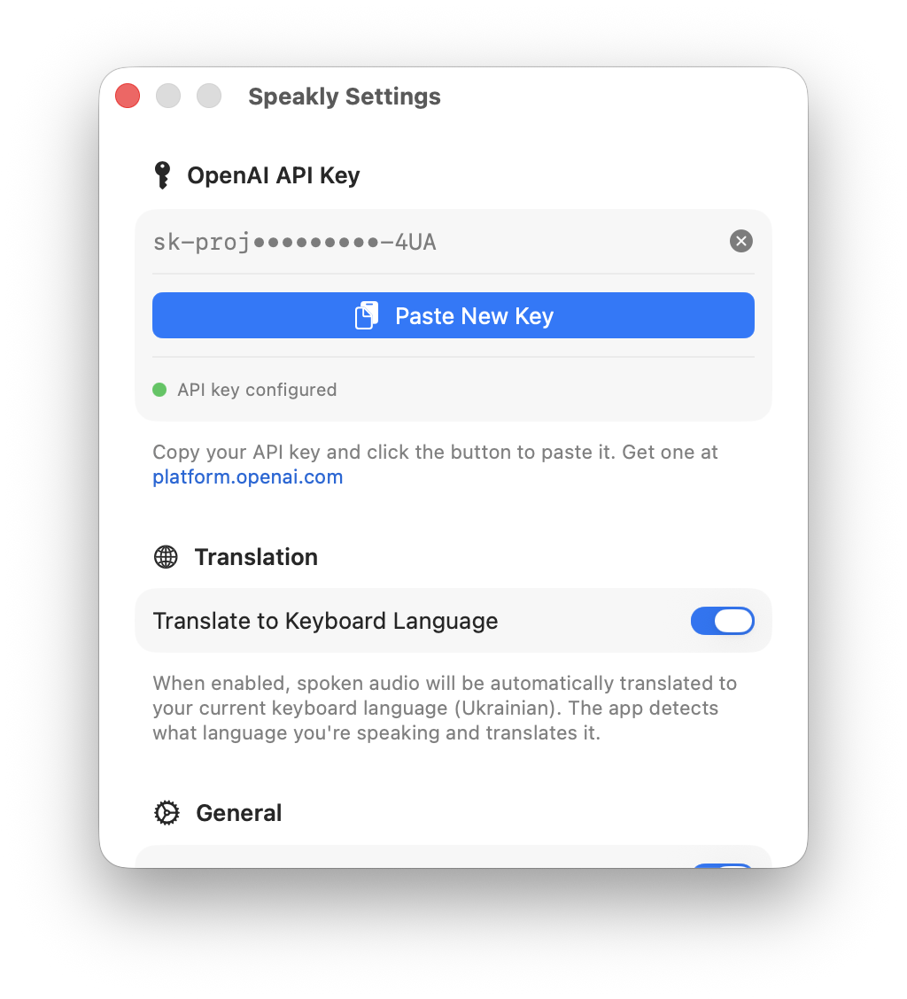

  
  
  # Speakly
  
  **Voice to text, instantly.**
  
  

    
    
    
  

  
  

    <em>Tired of breaking your flow to type every quick thought?</em> 
    <strong>Speakly lives in your menu bar and turns voice into clean text on demand.</strong>
  

## Features

- **Instant Transcription** — Hold the right Option(⌥) key to dictate, release to transcribe
- **Reliable accuracy** — Powered by OpenAI's GPT-4o Transcribe model for accurate results
- **Auto-translation** — Automatically translate to your current keyboard language (can be enabled in settings)
- **History** — Quick access to recent transcriptions, click to copy
- **Secure** — API key stored safely in macOS Keychain
- **Launch at login** — Always ready when you need it (can be enabled in settings)

 

## Configuration & Preferences

### Menu Bar Control

The menu bar popup is your command center for everything Speakly does. At a glance, you can see whether your API key is configured and ready to go, so there's no guessing before you start a recording session.

Below the status indicator, you'll find your transcription history — a list of your recent dictations. Each entry is just a click away from being copied to your clipboard, which means you can grab previous transcriptions without digging through notes or documents.

Need to switch microphones? The device picker is right there. Plug in a new USB mic or pair your AirPods, hit refresh, and select the input you want. Everything stays in one place so you never have to leave your current workflow.

 

---

### Settings

The settings panel keeps configuration simple and secure. Your OpenAI API key is stored in the macOS Keychain, not in plain text, so you can paste it once and forget about it. A quick status indicator confirms when the key is saved and valid.

Toggle on automatic translation if you work across languages. Speakly translates your dictation into whichever language your keyboard is currently set to — perfect for multilingual workflows or when you need to draft messages in a different language than you think in.

Finally, enable launch at login so Speakly is ready the moment your Mac boots up. No extra clicks, no hunting through Applications — just press the right Option key and start talking.

 

## Built With

| Category          | Technology                                           |
| ----------------- | ---------------------------------------------------- |
| **UI**            | SwiftUI, AppKit                                      |
| **Audio**         | AVFoundation, CoreAudio, Accelerate                  |
| **Transcription** | OpenAI GPT-4o Transcribe                             |
| **State**         | Combine                                              |
| **Security**      | Keychain Services                                    |
| **System**        | CoreGraphics, ApplicationServices, ServiceManagement |

 

## How It Works

Speakly uses OpenAI's GPT-4o Transcribe model for speech-to-text. The model automatically detects your spoken language and produces accurate transcriptions. With translation enabled, it can also convert your speech into your current keyboard language.

 

## Getting Started

1. Download the latest release or build from source
2. Move `Speakly.app` to your Applications folder
3. Launch Speakly — it appears in your menu bar
4. Open Settings and paste your [OpenAI API key](https://platform.openai.com/api-keys)
5. Start speaking!

  

   
  Made for people who think faster than they type.

